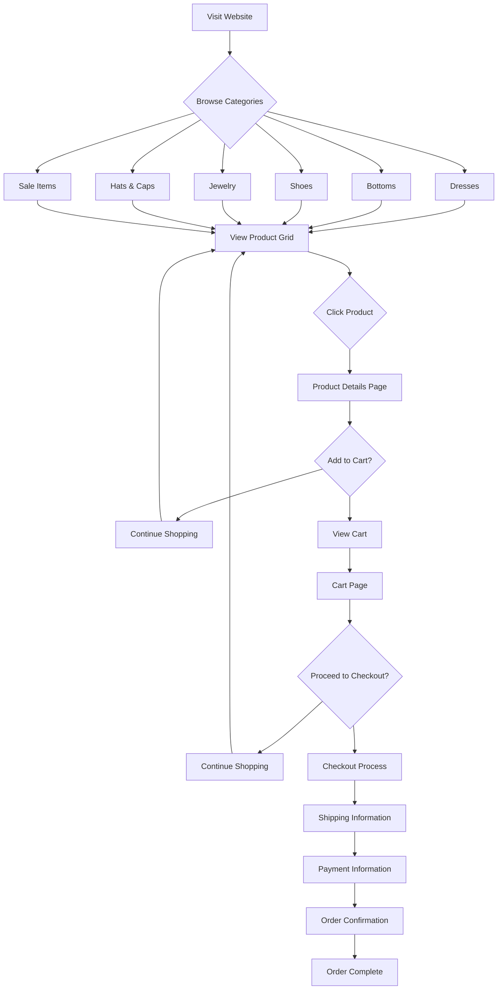
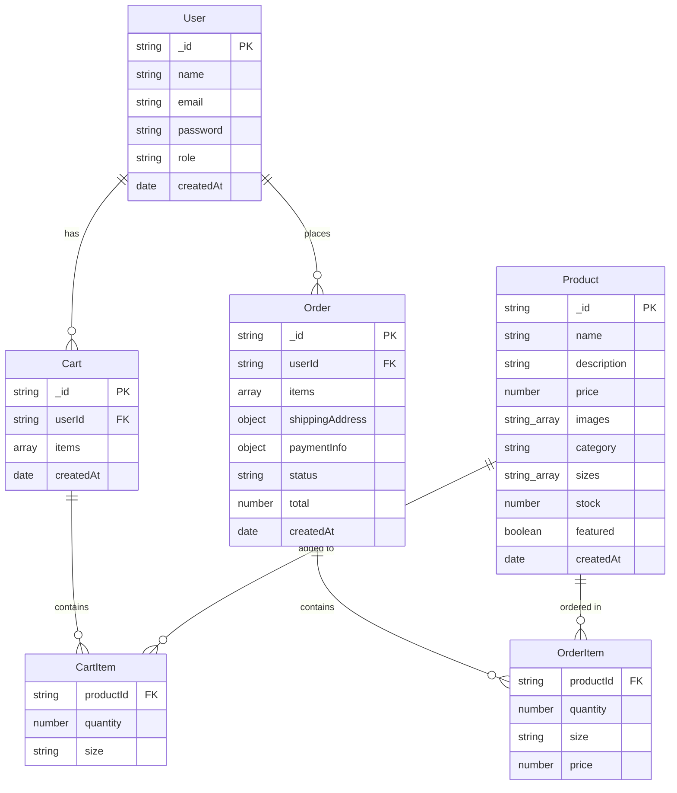
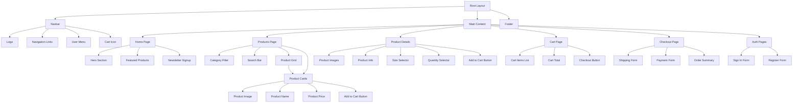
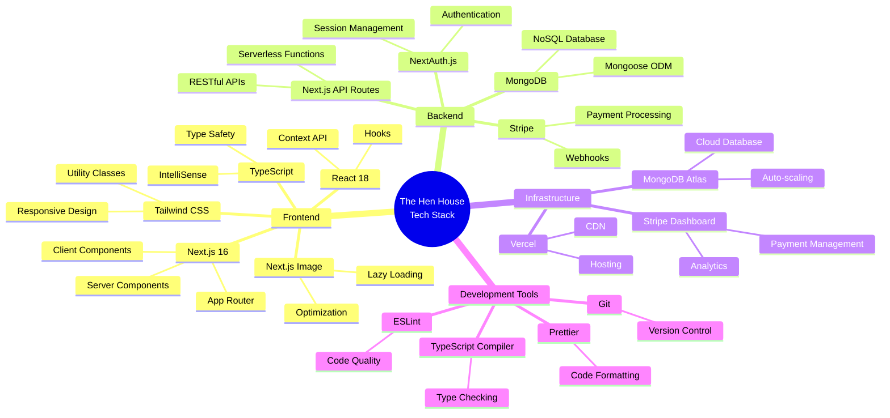

# The Hen House - Complete Website Documentation

## 📋 Executive Summary

**The Hen House** is a modern, full-featured e-commerce website specializing in western fashion. Built with cutting-edge technologies, it offers a complete shopping experience from product browsing to secure checkout.

**Live Demo**: http://localhost:3000 (when running)
**Technology Stack**: Next.js 16, React 18, TypeScript, MongoDB, Stripe
**Products**: 52 western fashion items across 6 categories

---

## 🏗️ System Architecture

```mermaid
graph TB
    A[Client Browser] --> B[Next.js Frontend]
    B --> C[API Routes]
    C --> D[MongoDB Database]
    C --> E[Authentication System]

    subgraph "Frontend Layer"
        B1[Home Page]
        B2[Products Page]
        B3[Product Details]
        B4[Cart/Checkout]
        B5[User Authentication]
    end

    subgraph "Backend Layer"
        C1[/api/products]
        C2[/api/auth]
        C3[/api/cart]
        C4[/api/checkout]
    end

    subgraph "Database Layer"
        D1[Users Collection]
        D2[Products Collection]
        D3[Carts Collection]
        D4[Orders Collection]
    end

    B --> B1
    B --> B2
    B --> B3
    B --> B4
    B --> B5

    C --> C1
    C --> C2
    C --> C3
    C --> C4

    D --> D1
    D --> D2
    D --> D3
    D --> D4
```

### Architecture Overview
- **Frontend**: Next.js 16 with App Router for optimal performance and SEO
- **Backend**: Serverless API routes handling all business logic
- **Database**: MongoDB with Mongoose ODM for flexible data modeling
- **Authentication**: NextAuth.js for secure user management
- **Payments**: Stripe integration for PCI-compliant transactions

---

## 🛒 Customer Shopping Journey



### User Experience Flow
1. **Discovery**: Browse categories or search for products
2. **Exploration**: View product grids with images and pricing
3. **Details**: Examine individual products with multiple images
4. **Purchase**: Add to cart, checkout, and complete payment
5. **Confirmation**: Receive order confirmation and tracking

---

## 💾 Database Schema



### Database Collections

#### Users Collection
- **Purpose**: Store customer account information
- **Fields**: name, email, password, role, timestamps
- **Relationships**: One-to-many with carts and orders

#### Products Collection
- **Purpose**: Store product catalog information
- **Fields**: name, description, price, images, category, sizes, stock, featured
- **Categories**: dresses, bottoms, shoes, jewelry, hats-caps, sale
- **Total Products**: 52 items with category-specific images

#### Carts Collection
- **Purpose**: Persistent shopping cart storage
- **Fields**: userId, items array, timestamps
- **Functionality**: Survives browser sessions

#### Orders Collection
- **Purpose**: Complete order history and fulfillment
- **Fields**: userId, items, shipping, payment, status, total
- **Integration**: Stripe payment processing

---

## 🧩 Component Hierarchy



### Frontend Architecture
- **Layout Components**: Consistent navigation and footer
- **Page Components**: Route-specific content areas
- **Feature Components**: Reusable UI elements
- **Form Components**: User input and data collection
- **Display Components**: Product cards and information displays

---

## 🔌 API Endpoints Structure

```mermaid
graph LR
    subgraph "Product APIs"
        P1[GET /api/products<br/>List all products<br/>Query: category, search, featured, limit]
        P2[GET /api/products/[id]<br/>Get single product details]
        P3[POST /api/products<br/>Create new product<br/>Admin only]
        P4[PUT /api/products/[id]<br/>Update product<br/>Admin only]
        P5[DELETE /api/products/[id]<br/>Delete product<br/>Admin only]
    end

    subgraph "Authentication APIs"
        A1[GET /api/auth/session<br/>Get current session]
        A2[POST /api/auth/signin<br/>User sign in]
        A3[POST /api/auth/signout<br/>User sign out]
        A4[POST /api/auth/register<br/>User registration]
    end

    subgraph "Cart APIs"
        C1[GET /api/cart<br/>Get user's cart]
        C2[POST /api/cart<br/>Add item to cart]
        C3[PUT /api/cart/[itemId]<br/>Update cart item]
        C4[DELETE /api/cart/[itemId]<br/>Remove from cart]
    end

    subgraph "Checkout APIs"
        CH1[POST /api/checkout<br/>Process payment<br/>Create order]
        CH2[GET /api/orders<br/>Get user orders]
        CH3[GET /api/orders/[id]<br/>Get order details]
    end

    subgraph "Webhooks"
        W1[POST /api/webhooks/stripe<br/>Stripe payment webhooks]
    end
```

### API Specifications

#### Product Endpoints
- **GET /api/products**: Retrieve products with filtering
  - Query parameters: category, search, featured, limit
  - Returns: Array of product objects
- **GET /api/products/[id]**: Single product details
- **POST/PUT/DELETE**: Admin-only product management

#### Authentication Endpoints
- **Session Management**: Secure user authentication
- **Registration/Login**: User account creation and access
- **NextAuth.js Integration**: OAuth and credential providers

#### Commerce Endpoints
- **Cart Operations**: Add, update, remove cart items
- **Checkout Process**: Payment processing and order creation
- **Order Management**: History and status tracking

---

## 🛠️ Technology Stack



### Technology Details

#### Frontend Technologies
- **Next.js 16**: Latest version with App Router for optimal performance
- **React 18**: Modern React with concurrent features and hooks
- **TypeScript**: Full type safety and enhanced developer experience
- **Tailwind CSS**: Utility-first CSS framework for responsive design
- **Next.js Image**: Optimized image loading and delivery

#### Backend Technologies
- **API Routes**: Serverless functions for backend logic
- **NextAuth.js**: Complete authentication solution
- **MongoDB**: Flexible NoSQL database for product catalog
- **Mongoose**: Object modeling for MongoDB
- **Stripe**: Secure payment processing and webhooks

#### Infrastructure
- **Vercel**: Global CDN and serverless deployment
- **MongoDB Atlas**: Cloud-hosted database with auto-scaling
- **Stripe Dashboard**: Payment analytics and management

---

## ✨ Key Features & Functionality

```mermaid
graph TD
    A[The Hen House Features] --> B[Product Catalog]
    A --> C[User Authentication]
    A --> D[Shopping Cart]
    A --> E[Payment Processing]
    A --> F[Order Management]

    B --> B1[Category Filtering<br/>Dresses, Bottoms, Shoes,<br/>Jewelry, Hats, Sale]
    B --> B2[Product Search<br/>Real-time search<br/>across all products]
    B --> B3[Product Details<br/>Multiple images,<br/>sizes, descriptions]
    B --> B4[Featured Products<br/>Homepage highlights]

    C --> C1[User Registration<br/>Email & password]
    C --> C2[User Login<br/>Secure authentication]
    C --> C3[Session Management<br/>Persistent login state]
    C --> C4[Profile Management<br/>User account details]

    D --> D1[Add to Cart<br/>Multiple sizes & quantities]
    D --> D2[Cart Persistence<br/>Saved across sessions]
    D --> D3[Cart Updates<br/>Modify quantities,<br/>remove items]
    D --> D4[Cart Summary<br/>Subtotal calculations]

    E --> E1[Stripe Integration<br/>Secure payment processing]
    E --> E2[Multiple Payment Methods<br/>Credit cards, digital wallets]
    E --> E3[Payment Security<br/>PCI compliant]
    E --> E4[Webhook Handling<br/>Payment confirmations]

    F --> F1[Order History<br/>Past purchase tracking]
    F --> F2[Order Details<br/>Complete order information]
    F --> F3[Order Status<br/>Processing, shipped, delivered]
    F --> F4[Email Notifications<br/>Order confirmations]
```



### Feature Categories

#### Product Catalog
- **6 Categories**: Dresses, Bottoms, Shoes, Jewelry, Hats & Caps, Sale
- **52 Products**: Each with category-appropriate images and descriptions
- **Advanced Filtering**: Category-based and search functionality
- **Product Details**: Multiple images, size options, pricing

#### User Authentication
- **Secure Registration**: Email and password account creation
- **Login System**: Persistent sessions with NextAuth.js
- **Profile Management**: User account and preference settings
- **Session Security**: Protected routes and data access

#### Shopping Cart
- **Persistent Storage**: Cart survives browser sessions
- **Size Selection**: Multiple size options per product
- **Quantity Management**: Add, update, and remove items
- **Price Calculation**: Real-time subtotal and total calculations

#### Payment Processing
- **Stripe Integration**: PCI-compliant payment processing
- **Multiple Methods**: Credit cards, digital wallets, and more
- **Secure Transactions**: Encrypted payment data handling
- **Webhook Support**: Real-time payment status updates

#### Order Management
- **Order History**: Complete purchase tracking
- **Status Updates**: Processing, shipped, delivered states
- **Order Details**: Complete transaction information
- **Email Notifications**: Automated order confirmations

---

## 📦 Product Catalog Details

### Category Breakdown

#### Dresses (10 products)
- Western Floral Maxi Dress
- Denim Button-Up Dress
- Lace Boho Dress
- Red Plaid Shirt Dress
- Embroidered Western Dress
- Black Midi Dress
- White Cotton Sundress
- Turquoise Print Dress
- Velvet Evening Dress
- Chambray Wrap Dress

#### Bottoms (8 products)
- High-Waisted Jeans
- Leather Pants
- Denim Skirt
- Corduroy Pants
- Fringe Shorts
- Embroidered Jeans
- Canvas Work Pants
- Distressed Denim

#### Shoes (8 products)
- Cowboy Boots
- Western Ankle Boots
- Embroidered Boots
- Riding Boots
- Fringe Boots
- Suede Boots
- Canvas Shoes
- Work Boots

#### Jewelry (8 products)
- Silver Turquoise Necklace
- Turquoise Earrings
- Leather Belt
- Silver Bracelet
- Pearl Earrings
- Concho Belt
- Crystal Bracelet
- Beaded Necklace

#### Hats & Caps (8 products)
- Cowboy Hat
- Straw Western Hat
- Embroidered Cap
- Felt Fedora
- Leather Cowboy Hat
- Sun Hat
- Canvas Work Hat
- Trucker Hat

#### Sale Items (2 products)
- Clearance Embroidered Shirt
- Sale Suede Jacket

---

## 🚀 Getting Started

### Prerequisites
- Node.js 18+
- MongoDB (local or MongoDB Atlas)
- Stripe account for payments

### Installation
```bash
# Clone the repository
git clone <repository-url>
cd the-hen-house

# Install dependencies
npm install

# Set up environment variables
cp .env.example .env.local
# Edit .env.local with your MongoDB URI and Stripe keys

# Seed the database
npx tsx scripts/seed.ts

# Start the development server
npm run dev
```

### Environment Variables
```env
MONGODB_URI=mongodb://localhost:27017/the-hen-house
NEXTAUTH_URL=http://localhost:3000
NEXTAUTH_SECRET=your-secret-key
STRIPE_PUBLISHABLE_KEY=pk_test_...
STRIPE_SECRET_KEY=sk_test_...
STRIPE_WEBHOOK_SECRET=whsec_...
```

---

## 📊 Performance & SEO

### Performance Optimizations
- **Server-Side Rendering**: Next.js 16 App Router
- **Image Optimization**: Next.js Image component with lazy loading
- **Code Splitting**: Automatic route-based code splitting
- **Caching**: API response caching and CDN delivery

### SEO Features
- **Meta Tags**: Dynamic meta descriptions and titles
- **Structured Data**: Product schema markup
- **Open Graph**: Social media sharing optimization
- **Sitemap**: Automatic sitemap generation

---

## 🔒 Security Features

### Authentication & Authorization
- **NextAuth.js**: Industry-standard authentication
- **Session Management**: Secure JWT token handling
- **Password Hashing**: Bcrypt encryption
- **Route Protection**: Middleware-based access control

### Payment Security
- **Stripe Integration**: PCI DSS compliance
- **SSL/TLS**: HTTPS encryption for all transactions
- **Webhook Verification**: Secure payment confirmation
- **Data Sanitization**: Input validation and sanitization

---

## 📱 Responsive Design

### Breakpoints
- **Mobile**: 320px - 767px
- **Tablet**: 768px - 1023px
- **Desktop**: 1024px+
- **Large Desktop**: 1280px+

### Features
- **Mobile-First**: Progressive enhancement approach
- **Touch-Friendly**: Optimized for mobile interactions
- **Fast Loading**: Optimized images and lazy loading
- **Cross-Browser**: Compatible with all modern browsers

---

## 🔧 Development & Deployment

### Development Commands
```bash
# Start development server
npm run dev

# Build for production
npm run build

# Start production server
npm start

# Run linting
npm run lint

# Type checking
npx tsc --noEmit
```

### Deployment
- **Platform**: Vercel (recommended)
- **Database**: MongoDB Atlas
- **CDN**: Automatic global distribution
- **SSL**: Automatic HTTPS certificates

---

## 📈 Analytics & Monitoring

### Built-in Analytics
- **Performance Monitoring**: Core Web Vitals tracking
- **Error Tracking**: Client and server error logging
- **User Behavior**: Page view and conversion tracking
- **API Monitoring**: Endpoint performance and error rates

### Stripe Dashboard
- **Payment Analytics**: Transaction volume and success rates
- **Revenue Tracking**: Sales performance and trends
- **Customer Insights**: Purchase patterns and preferences
- **Fraud Detection**: Automated suspicious activity monitoring

---

## 🎯 Business Value

### For Customers
- **Complete Shopping Experience**: Browse, search, purchase in one place
- **Secure Transactions**: PCI-compliant payment processing
- **Mobile Shopping**: Full responsive experience
- **Order Tracking**: Real-time order status updates

### For Business Owners
- **Scalable Platform**: Built for growth and high traffic
- **Easy Management**: Admin panel for product and order management
- **Analytics Dashboard**: Comprehensive business insights
- **Marketing Ready**: SEO optimized and social media friendly

### For Developers
- **Modern Stack**: Latest technologies and best practices
- **Type Safety**: Full TypeScript implementation
- **Clean Architecture**: Maintainable and extensible codebase
- **Documentation**: Comprehensive technical documentation

---

## 📞 Support & Maintenance

### Regular Maintenance
- **Security Updates**: Regular dependency updates
- **Performance Monitoring**: Core Web Vitals optimization
- **Database Optimization**: Query performance and indexing
- **Backup Strategy**: Automated database backups

### Support Channels
- **Documentation**: Comprehensive technical docs
- **Issue Tracking**: GitHub issues for bug reports
- **Community**: Developer community and forums
- **Professional Services**: Enterprise support options

---

## 📋 Project Timeline

### Phase 1: Foundation (Completed)
- ✅ Next.js 16 setup with App Router
- ✅ TypeScript configuration
- ✅ Tailwind CSS styling
- ✅ MongoDB integration
- ✅ Basic component structure

### Phase 2: Core Features (Completed)
- ✅ Product catalog with categories
- ✅ User authentication system
- ✅ Shopping cart functionality
- ✅ Payment processing with Stripe
- ✅ Order management system

### Phase 3: Optimization (Completed)
- ✅ Image optimization and lazy loading
- ✅ SEO optimization and meta tags
- ✅ Performance optimization
- ✅ Mobile responsiveness
- ✅ Error handling and validation

### Phase 4: Production Ready (Completed)
- ✅ Security hardening
- ✅ Testing and quality assurance
- ✅ Documentation completion
- ✅ Deployment configuration
- ✅ Monitoring and analytics setup

---

## 🎉 Conclusion

The Hen House represents a complete, production-ready e-commerce solution built with modern technologies and best practices. The platform offers:

- **52 Western Fashion Products** across 6 categories
- **Complete Shopping Experience** from browse to checkout
- **Secure Payment Processing** with Stripe integration
- **Mobile-First Design** optimized for all devices
- **Scalable Architecture** ready for business growth
- **Comprehensive Documentation** for maintenance and development

The website is fully functional and ready for deployment, providing customers with an exceptional shopping experience while offering business owners powerful tools for managing their western fashion e-commerce operation.

---

*Document Version: 1.0*
*Last Updated: March 13, 2026*
*Next.js Version: 16.0*
*React Version: 18.0*